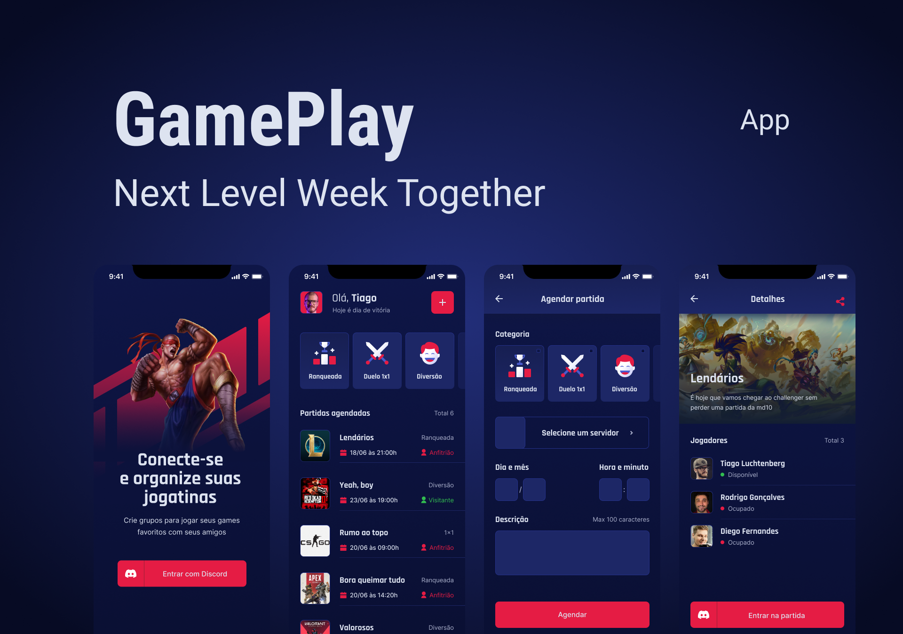

<div align="center">
  
</div>
<br />

<p align="center">
  <a href="#sobre-o-projeto">Sobre o projeto</a>&nbsp;&nbsp;&nbsp;|&nbsp;&nbsp;&nbsp;
  <a href="#como-utilizar">Como utilizar</a>&nbsp;&nbsp;&nbsp;|&nbsp;&nbsp;&nbsp;
  <a href="#construído-utilizando">Construído utilizando</a>&nbsp;&nbsp;&nbsp;|&nbsp;&nbsp;&nbsp;
  <a href="#como-contribuir">Como contribuir</a>&nbsp;&nbsp;&nbsp;|&nbsp;&nbsp;&nbsp;
  <a href="#licença">Licença</a>
</p>

<br/>
<div align="center">
  <a href="https://github.com/ViniciusMazon/gameplay"></a>
</div>
<br/>

# Sobre o projeto
O GamePlay é uma aplicação mobile, integrada com o Discord, que possibilita organizar sua jogatina com seus amigos por meio de agendamentos.

Projeto desenvolvido durante a NLW 6, evento da [Rocketseat](https://github.com/rocketseat-education)💜.
<br />

<div align="center">
  
</div>

# Como utilizar
1 - Clone o projeto
```
$ git clone https://github.com/ViniciusMazon/gameplay.git
```
2 - Instale as dependências
```
$ yarn
```
3 - Rode o projeto
```
$ yarn start
```
4 - Será aberta uma aba no seu navegador, selecione a opção "Tunnel"
5 - Instale o aplicativo do [Expo](https://play.google.com/store/apps/details?id=host.exp.exponent&hl=pt_BR&gl=US) no seu celular
5 - No terminal que está rodando o projeto, pressione:
```
$ a
```
A aplicação será aberta no seu celular

# Construído utilizando
* [expo](https://docs.expo.io/)
* [expo-google-fonts](https://docs.expo.io/guides/using-custom-fonts/#using-a-google-font)
* [expo-linear-gradient](https://docs.expo.io/versions/latest/sdk/linear-gradient/)
* [react-native-iphone-x-helper](https://github.com/ptelad/react-native-iphone-x-helper)
* [react-navigation](https://reactnavigation.org/)
* [vector-icons](https://icons.expo.fyi/)
* [react-native-svg](https://docs.expo.io/versions/latest/sdk/svg/)
* [react-native-svg-transformer](https://github.com/kristerkari/react-native-svg-transformer)
* [auth-session](https://docs.expo.dev/versions/latest/sdk/auth-session/)
* [axios](https://github.com/axios/axios)
* [dotenv](https://www.npmjs.com/package/dotenv)
* [babel-plugin-inline-dotenv](https://www.npmjs.com/package/babel-plugin-inline-dotenv)
* [expo async-storage](https://docs.expo.dev/versions/latest/sdk/async-storage/)
* [react-native-uuid](https://www.npmjs.com/package/react-native-uuid)

# Como contribuir

- Faça um fork desse repositório;
- Clone esse repositório em sua máquina: git clone `https://github.com/ViniciusMazon/gameplay.git`
- Cria uma branch com a sua feature: `git checkout -b minha-feature`;
- Faça o commit dos testes: `git commit -m 'test: Nome do teste'`;
- Faça commit das suas alterações: `git commit -m 'feat: Minha nova feature'`;
- Faça push para a sua branch: `git push origin minha-feature`.

Depois que o merge da sua pull request for feito, você pode deletar a sua branch.
</br>

# Licença

Esse projeto está sob a licença MIT. Veja o arquivo LICENSE para mais detalhes.

---

Feito com 🖤 por Vinicius Mazon.